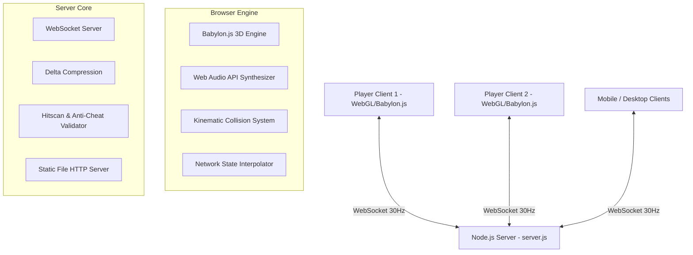

# 🎯 Thalvorn

<div align="center">

**A high-performance, open-source 3D First-Person & Third-Person Shooter (FPS/TPS) that runs natively in the browser — no installs, no builds, no external assets.**

[](https://www.babylonjs.com/)
[](https://www.khronos.org/webgl/)
[](https://nodejs.org/)
[](https://github.com/websockets/ws)
[](https://www.docker.com/)
[](LICENSE)
[](#-contributing)
[](#-acknowledgements)

</div>

---

An open-source **3D First-Person & Third-Person Shooter (FPS/TPS)** built with **Babylon.js** and **WebSockets**. It features procedurally generated forest and city environments, dynamic traffic, customizable avatars, fully synthesized procedural audio, and ultra-low-latency LAN/WAN multiplayer — all with **zero external game assets and zero build steps**.

> **Zero build step.** Clone, `npm install`, `npm start`, and play. The entire game is plain ES6 JavaScript modules served directly by the included Node.js server.

> 🤖 **Created 100% with AI.** The entire game — architecture, gameplay code, procedural environments, synthesized audio, and documentation — was created entirely with AI assistance.

---

## 📑 Table of Contents

- [Screenshots](#-screenshots)
- [Features](#-features)
- [Live Demo](#-live-demo)
- [Getting Started](#-getting-started)
- [Gameplay & Controls](#-gameplay--controls)
- [Maps & Environments](#-maps--environments)
- [Weapon Arsenal](#-weapon-arsenal)
- [Pickups System](#-pickups-system)
- [Architecture & Tech Stack](#-architecture--tech-stack)
- [Project Structure](#-project-structure)
- [Configuration](#-configuration)
- [Deployment](#-deployment)
- [Custom Avatar System](#-custom-avatar-system)
- [Anti-Cheat & Security](#-anti-cheat--security)
- [Troubleshooting & FAQ](#-troubleshooting--faq)
- [Roadmap](#-roadmap)
- [Contributing](#-contributing)
- [Code of Conduct](#-code-of-conduct)
- [License](#-license)
- [Acknowledgements](#-acknowledgements)
- [Support](#-support)

---

## 📸 Screenshots

<!-- TODO: Add real gameplay screenshots here. Drop images into a /screenshots folder and reference them like so:


-->

*Screenshots coming soon. Contributions with screenshots or a gameplay video are very welcome!*

---

## ✨ Features

### 🎮 Gameplay
- **Dual camera system (FPS / TPS):** seamlessly switch between First-Person and Third-Person views with smooth camera interpolation and head-clipping prevention.
- **Kinematic character controller:** walk, sprint, crouch, jump, and climb ramps/rooftops with realistic fall damage.
- **Weapon switching, reloading, and timed weapon drops** with a knife as your permanent default weapon.
- **Team-based modes:** Team X vs Team Y with automatic team balancing and team-colored avatars.

### 🌐 Real-Time Multiplayer (30 tick)
- Synchronized movement, rotation (yaw & pitch), animations, combat hitscan raycasting, and health over **WebSockets**.
- **Delta compression** to minimize bandwidth and **client-side interpolation** for smooth 60/144 FPS motion.
- **Auto-reconnect** with exponential backoff (up to 10 attempts).

### 🗺️ Procedural Environments
- **🌲 Forest Map (200×200):** heightmap-based terrain with dynamic hills, valleys, and hundreds of dense pine/oak trees rendered via **GPU Thin Instances**.
- **🏙️ Urban City Map (100×100):** high-rise buildings, asphalt road grid, spiral ramp staircases, team spawn zones, and **autonomous traffic** (sedans, pickups, buses).

### 🔊 Procedural Audio (Web Audio API)
- **100% code-synthesized sound** — no external audio files needed. Gunshots, reload clicks, footsteps, knife swings, hit markers, and forest ambient wind are all generated at runtime.

### 🔫 Weapon Feel
- Hitscan ballistics with **spread, recoil, muzzle flash, impact particles, and hit markers**.
- **Tactical sniper scope (Rytec AMR):** custom SVG reticle with 8× magnification and mil-dot range markings.

### 📱 Mobile Support
- Responsive on-screen controls: dynamic virtual joystick, drag-to-aim, and dedicated touch buttons.

### 📸 Custom Avatars
- Upload a custom face and body image that are applied as **3D textures** on your soldier model and broadcast to all connected clients.

### 🛡️ Anti-Cheat
- Server-side speed validation, weapon range verification, fire-rate limiting, friendly-fire rejection, and a 2-second spawn invulnerability shield.

---

## 🌐 Live Demo

The project ships with a [`fly.toml`](fly.toml) configured for **[Fly.io](https://fly.io/)** and a `.vercel` configuration for **[Vercel](https://vercel.com/)**.

> Deploy your own instance in minutes — see [Deployment](#-deployment). A public demo link will be added here once the maintainers publish a hosted instance.

---

## 🚀 Getting Started

### Prerequisites

| Requirement | Version | Notes |
| :--- | :--- | :--- |
| [Node.js](https://nodejs.org/) | 18+ | Required to run the game server |
| A modern browser | — | WebGL 2.0 capable (Chrome, Edge, Firefox, Safari) |
| [npm](https://www.npmjs.com/) | — | Bundled with Node.js |

> No bundler (Webpack/Vite), no TypeScript build step, and no external 3D assets are required.

### 1. Clone the repository

```bash
git clone https://github.com/your-username/thalvorn-shooter.git
cd thalvorn-shooter
```

### 2. Install dependencies

```bash
npm install
```

> Dependencies are minimal: the server only needs [`ws`](https://github.com/websockets/ws). The client loads Babylon.js from a **pinned CDN** (`6.49.0`).

### 3. Start the server

```bash
npm start
```

### 4. Play

Open your browser and navigate to:

```
http://localhost:3000
```

Enter a name, choose your map (**Forest** or **City**), optionally upload a custom avatar, and click **⚡ Connect & Play**.

---

## 🕹️ Gameplay & Controls

### Keyboard & Mouse (Desktop)

| Input | Action |
| :--- | :--- |
| <kbd>W</kbd> <kbd>A</kbd> <kbd>S</kbd> <kbd>D</kbd> | Move character |
| <kbd>Mouse Move</kbd> | Aim / Look (Pointer Lock API) |
| <kbd>Left Click (LMB)</kbd> | Fire weapon / swing knife |
| <kbd>Shift</kbd> (hold) | Sprint |
| <kbd>Ctrl</kbd> / <kbd>C</kbd> | Crouch |
| <kbd>Space</kbd> | Jump |
| <kbd>V</kbd> | Toggle perspective (**FPS** ↔ **TPS**) |
| <kbd>R</kbd> | Reload current weapon |
| <kbd>H</kbd> | Holster weapon |
| <kbd>Tab</kbd> (hold) | View live scoreboard |
| <kbd>Esc</kbd> | Pause / open settings |
| ⛶ Fullscreen button | Enter fullscreen (blocks browser shortcuts) |

### Mobile Touch Controls

*Call of Duty Mobile-style layout — proven, ergonomic thumb placement.*

- **Left thumb:** floating virtual joystick for movement; push it fully forward to **auto-sprint**.
- **Right thumb:** drag to look/aim + dedicated **fire button** (bottom-right).
- **Touch buttons:** 🔥 Fire · ⬆ Jump · ⬇ Crouch · 🔄 Reload · 📷 Camera toggle.

---

## 🗺️ Maps & Environments

| Map | Size | Description | Key Elements |
| :--- | :--- | :--- | :--- |
| **🌲 Forest** | 200 × 200 | Procedural mountainous wilderness | Heightmap hills, thin-instance pines/oaks, ambient forest sounds, scattered pickups, free-for-all spawns |
| **🏙️ City** | 100 × 100 | Urban grid with concrete streets | Multi-story buildings, spiral ramps, autonomous vehicle traffic, Team X vs Team Y spawns |

---

## 🔫 Weapon Arsenal

| Weapon | Icon | Type | Damage | Fire Rate | Max Ammo | Range | Special Traits |
| :--- | :---: | :---: | :---: | :---: | :---: | :---: | :--- |
| **Tactical Knife** | 🔪 | Melee | 35 | 0.5s | ∞ | 3m | Default permanent weapon, high close-quarters damage |
| **MW11 Pistol** | 🔫 | Semi-Auto | 20 | 0.25s | 12 / 12 | 100m | Fast sidearm, reliable mid-range backup |
| **M16 Rifle** | 🎯 | Full-Auto | 25 | 0.12s | 30 / 30 | 150m | Rapid assault rifle with continuous automatic fire |
| **BY15 Shotgun** | 💥 | Scatter | 5 × 8 | 0.8s | 8 / 8 | 30m | 8 pellets per shell (up to 40 damage), lethal up close |
| **Rytec AMR .50** | 🔭 | Sniper | 90 | 1.2s | 5 / 5 | 350m | Devastating high-caliber rifle with **8× scope & SVG reticle** |

---

## 🎁 Pickups System

Floating metallic spheres with gentle bobbing animations are scattered around the map:

| Sphere | Color | Effect |
| :--- | :---: | :--- |
| 🟢 **Health** | Green | Restores +25 HP |
| 🟤 **Weapon Drop** | Brown/Bronze | Grants a random timed weapon (MW11, M16, BY15, Rytec) |
| ⚪ **Ammo** | Grey | Refills current weapon magazine |

---

## 🛠️ Architecture & Tech Stack



| Layer | Technology |
| :--- | :--- |
| **Frontend Engine** | [Babylon.js 6.x](https://www.babylonjs.com/) (pinned `6.49.0`, loaded via CDN) |
| **3D Formats** | GLTF / GLB binary models, PBR metallic-roughness materials |
| **Audio Engine** | HTML5 Web Audio API (procedural oscillator & noise synthesis) |
| **Backend** | Node.js HTTP server + [`ws`](https://github.com/websockets/ws) WebSocket server |
| **Styling & UI** | Vanilla CSS3 (responsive glassmorphism, pointer-lock overlays) |
| **Build** | Zero build step — pure ES6 modules (`import`/`export`) |

---

## 📁 Project Structure

```
.
├── index.html                   # Main HTML5 entry point & HUD UI overlays
├── package.json                 # Project configuration & start scripts
├── Dockerfile                   # Production container configuration
├── fly.toml                     # Fly.io cloud deployment settings
├── .gitignore                   # Git exclusion rules
├── LICENSE                      # MIT Open Source License
│
├── css/
│   └── styles.css               # HUD, scoreboard, menus & mobile touch styles
│
├── js/
│   ├── main.js                  # Game entry point, loop & subsystem orchestrator
│   ├── player.js                # Kinematic character controller & state machine
│   ├── camera.js                # FPS/TPS camera transitions & sensitivity
│   ├── weapons.js               # Weapon stats, ballistics, recoil & scopes
│   ├── remote-players.js        # Multiplayer avatar interpolation & rendering
│   ├── network.js               # Client WebSocket connection & packet handling
│   ├── audio.js                 # Procedural Web Audio API sound synthesis
│   ├── forest.js                # Procedural forest & GPU thin-instance foliage
│   ├── city.js                  # City geometry, roads & building colliders
│   ├── terrain.js               # Heightmap terrain generator & ground raycasting
│   ├── vehicles.js              # Autonomous traffic pathfinding & car models
│   ├── pickups.js               # Interactive HP, ammo & weapon drop spheres
│   ├── minimap.js               # Real-time top-down 2D canvas radar
│   ├── hud.js                   # Crosshair, hit markers, HP & kill feed
│   ├── touch-controls.js        # Mobile on-screen joystick & virtual buttons
│   └── environment.js           # Skybox, directional lighting & shadows
│
├── models/
│   ├── soldier.glb              # 3D animated soldier character model
│   └── environmentSpecular.env  # Image-based lighting environment map
│
└── server/
    ├── package.json             # Server dependencies (ws)
    ├── package-lock.json        # Lockfile for reproducible installs
    └── server.js                # Authoritative WebSocket game server & static host
```

---

## ⚙️ Configuration

Gameplay and server settings live at the top of [`server/server.js`](server/server.js):

| Constant | Default | Description |
| :--- | :--- | :--- |
| `PORT` | `3000` | HTTP/WebSocket port (override with the `PORT` env var) |
| `TICK_RATE` | `30` | Server broadcasts per second (33.3 ms interval) |
| `MAX_HP` | `100` | Starting player health |
| `RESPAWN_DELAY` | `3000` | Respawn cooldown in milliseconds |
| `INVULN_DURATION` | `2000` | Spawn protection duration (ms) |
| `MAX_SPEED` | `15` | Anti-cheat maximum permitted speed (units/s) |
| `MSG_RATE_LIMIT` | `60` | Max messages per second per client |
| `MAX_MSG_SIZE` | `50 KB` | Max size of a normal message |
| `MAX_JOIN_MSG_SIZE` | `5 MB` | Max size of the join message (includes avatars) |

### Environment Variables

| Variable | Description | Default |
| :--- | :--- | :--- |
| `PORT` | Port the server listens on | `3000` |

---

## ☁️ Deployment

### 1. Local Development

```bash
npm install
npm start
# → http://localhost:3000
```

### 2. LAN Multiplayer

Play with friends on the same Wi-Fi/Ethernet network:

1. Find your local IP (`ipconfig` on Windows, `ifconfig`/`ip a` on macOS/Linux).
2. Start the server on the host: `npm start`.
3. Others open `http://<host-ip>:3000` in a browser.

### 3. Docker

```bash
docker build -t fps-shooter .
docker run -d -p 3000:3000 --name fps-game fps-shooter
```

### 4. Fly.io

```bash
fly launch      # first time
fly deploy      # subsequent updates
```

### 5. Vercel (static hosting)

The client is fully static, but multiplayer requires the WebSocket server. Host the client on Vercel and point players at a separate server, or run the server locally and connect by IP.

---

## 📸 Custom Avatar System

Personalize your soldier from the connection screen:

1. **Face image** — recommended `128 × 128 px` (square).
2. **Body / torso image** — recommended `128 × 256 px` (portrait).

Images are **downscaled client-side** and converted to compressed JPEG DataURLs before being sent, then mapped as real-time textures on your model and broadcast to all other clients.

---

## 🛡️ Anti-Cheat & Security

The server validates gameplay to keep matches fair:

- ✅ **Speed limit validation** with rubberbanding on anomaly.
- ✅ **Weapon range verification** on every hit.
- ✅ **Fire-rate limiting** per weapon.
- ✅ **Friendly-fire rejection** (same-team hits ignored).
- ✅ **Spawn invulnerability** (2 s, canceled on attack).
- ✅ **Input sanitization** (player names, avatar payloads).
- ✅ **Message size & rate limiting** per client.

> ⚠️ This project is designed for trusted LAN play. It is **not** a hardened, production-grade anti-cheat or security solution for public internet play — see [Roadmap](#-roadmap).

---

## 🧪 Troubleshooting & FAQ

<details>
<summary><strong>The page loads but the 3D view is black / nothing renders</strong></summary>

- Confirm your browser supports **WebGL 2.0** (visit `chrome://gpu` in Chrome or `about:support` in Firefox).
- Open the browser console (F12) and check for errors — `soldier.glb` must be served from `./models/`.
- Make sure the server is running (`npm start`) and you loaded the page **from the server** (not by double-clicking `index.html`).
</details>

<details>
<summary><strong>Other players can't connect over LAN</strong></summary>

- Check your firewall allows inbound connections on port `3000`.
- Ensure players use `http://<your-LAN-IP>:3000`, not `localhost`.
- For HTTPS deployments, the client automatically switches to `wss://`.
</details>

<details>
<summary><strong>My custom avatar doesn't show up</strong></summary>

- Images are downscaled to JPEG on upload; very large or animated formats may be re-encoded. Use static PNG/JPG images for best results.
</details>

<details>
<summary><strong>The game runs slowly on mobile</strong></summary>

- Shadows and SSAO are reduced automatically on mobile. Close other tabs and ensure your device supports hardware WebGL acceleration.
</details>

---

## 🗺️ Roadmap

Planned improvements and ideas (in rough priority order):

- [ ] **Server-authoritative pickups** (currently client-simulated with synchronized IDs).
- [ ] **Line-of-sight (LOS) hit validation** to prevent shooting through walls.
- [ ] More maps and game modes (deathmatch, capture the flag).
- [ ] Player stats persistence and leaderboards.
- [ ] Voice chat (WebRTC).
- [ ] Havok physics integration for full rigid-body simulation.
- [ ] Gamepad support.

Have an idea? Open an issue or submit a PR!

---

## 🤝 Contributing

Contributions, issues, and feature requests are welcome! 🎉

1. **Fork** the repository.
2. Create a **feature branch**:
   ```bash
   git checkout -b feature/AmazingFeature
   ```
3. **Commit** your changes (see conventions below):
   ```bash
   git commit -m "feat: add AmazingFeature"
   ```
4. **Push** to your branch:
   ```bash
   git push origin feature/AmazingFeature
   ```
5. Open a **Pull Request**.

### Commit Message Conventions

We follow [Conventional Commits](https://www.conventionalcommits.org/):

- `feat:` — a new feature
- `fix:` — a bug fix
- `docs:` — documentation only
- `refactor:` — code change that neither fixes a bug nor adds a feature
- `perf:` — performance improvement
- `style:` — formatting (no code change)
- `test:` — adding tests

### Code Style

- Plain **ES6 JavaScript** (no TypeScript, no build step) — keep it bundler-free.
- Use the existing module pattern: one self-contained file per system under `js/`.
- Keep client and server concerns separated (client in `js/`, authoritative server logic in `server/server.js`).
- Avoid adding external assets; prefer procedural generation to keep the repo lightweight.

---

## 📜 Code of Conduct

Please review our [Code of Conduct](CODE_OF_CONDUCT.md) to understand the community standards and expectations. *(A `CODE_OF_CONDUCT.md` template — e.g. the [Contributor Covenant](https://www.contributor-covenant.org/) — is recommended and can be added on request.)*

---

## 📄 License

Distributed under the **MIT License**. See [`LICENSE`](LICENSE) for more information.

---

## 🙏 Acknowledgements

- 🤖 **Artificial Intelligence** — this game was created **100% with AI**: design, architecture, code, procedural assets, audio synthesis, and this documentation.
- [Babylon.js](https://www.babylonjs.com/) — the powerful 3D WebGL/WebGPU engine.
- [WebSockets (ws)](https://github.com/websockets/ws) — ultra-fast real-time networking.
- [Google Antigravity](https://deepmind.google/) — agentic AI pair programming & architecture.

---

## ⭐ Support

If this project is useful to you, please consider **starring the repository** ⭐ — it helps the project reach more people in the community.

---

<p align="center">
  Made with ❤️ for the 3D Web & Open Source Gaming Community.
</p>
